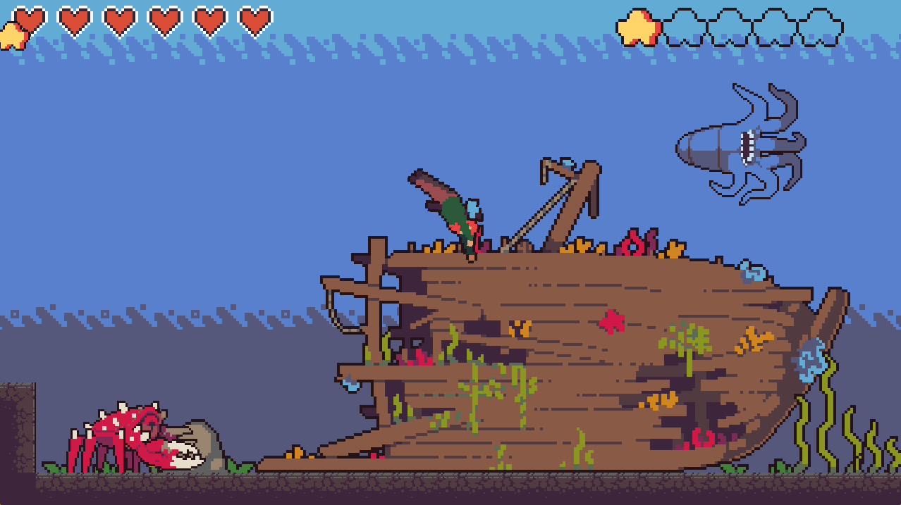
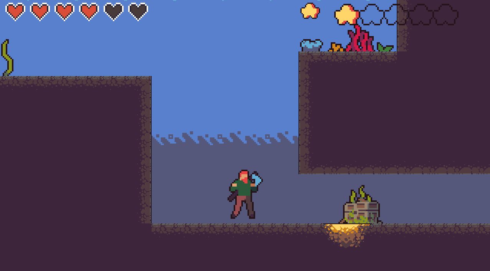
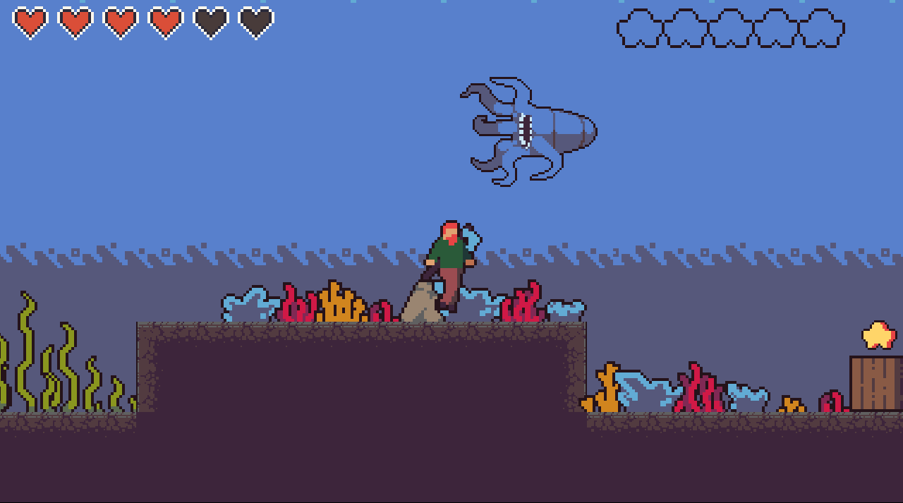

# Sea of Stars: Odyssey Below

Sea of Stars: Odyssey Below is an underwater, sea exploration/survival platformer.
This game was created as my project in CSC 391 - Game Development. Sea of Stars is
written in C++ and utilizes the SDL2 library. This project demonstrates use of a
[finite state machine](https://en.wikipedia.org/wiki/Finite-state_machine) used to
handle all actions, a [quadtree](https://en.wikipedia.org/wiki/Quadtree) for checking
collisions on a large scale, and
[unordered maps](<https://en.wikipedia.org/wiki/Unordered_associative_containers_(C%2B%2B)>)
to store assets.
<video src="READMEdemo.mp4" controls title="Title"></video>

<!-- 

 -->

While avoiding any enemy mobs and obstacles that try and get the best of you, gather all the stars scattered around each level to progress and reach the end of the game!

## Building

The game is written in C++ and uses features from the C++17
standard. [CMake](https://cmake.org/) is used to build all components.
and works well with the
[CMakeTools](https://marketplace.visualstudio.com/items?itemName=ms-vscode.cmake-tools)
extension in VSCode.

To configure it manually, type

```
cd build
cmake ..
```

then build it using

```
cmake --build .
```

Either method will generate an executable in the build directory.

## Running

Running this game requires the SDL2 library to be installed. This
is done very easily on MacOS and Windows through [MSYS2](https://www.msys2.org/#installation). <br>

In the MSYS2 terminal, the following command can be run to install the library and
configure all pathing for DLL files.<br>
`pacman -S mingw64/mingw-w64-x86_64-SDL2 mingw64/mingw-w64-x86_64-SDL2_mixer mingw64/mingw-w64-x86_64-SDL2_image mingw64/mingw-w64-x86_64-SDL2_ttf mingw64/mingw-w64-x86_64-SDL2_net`

The terminal used to run the game must be in the parent directory that the "assets" folder is within. From there, you can run `.\build\____` (name of executable within build folder)

## Assets

This game loads all assets through text files. Using the SDL2 library,
pixel coordinates can be used to gather a sprite to be displayed on the screen.
This is used for the tiles, enemy mobs, animations, backgrounds, player models,
and everything else you see on the screen. The very first line of each of these text
files is the name of the .png that the coordinates refer to. Each different
form of animations require different types of data to be stored,
but an example of what these parameters would look like is:

```
image_filename.png

name_of_sprite x y width height
animated_sprite x y width height frames
```

All sprites used can be found on https://craftpix.net/.<br>
[Tileset](https://craftpix.net/product/water-pack-tileset-for-platformer-pixel-art/?num=1&count=18&sq=underwater&pos=0)<br>
[Enemy Mobs](https://craftpix.net/product/water-monsters-pixel-art-sprite-sheet-pack/)<br>
[Character](https://craftpix.net/freebies/free-swimming-characters-animation-pixel-art/)<br>

## Level Loading

Level loading is accomplished using a text file that references
sprites gathered by the text files mentioned above. Theme-basic.txt
is essentially a list of all tiles that could be included in a level.
Each tile is assigned a keyboard character and marked true or false for
whether it is a blocking tile. These characters can be formatted in a separate
text file to create the level (see level-01.txt). How level-01.txt appears
as characters, is translated into the level as tiles.
